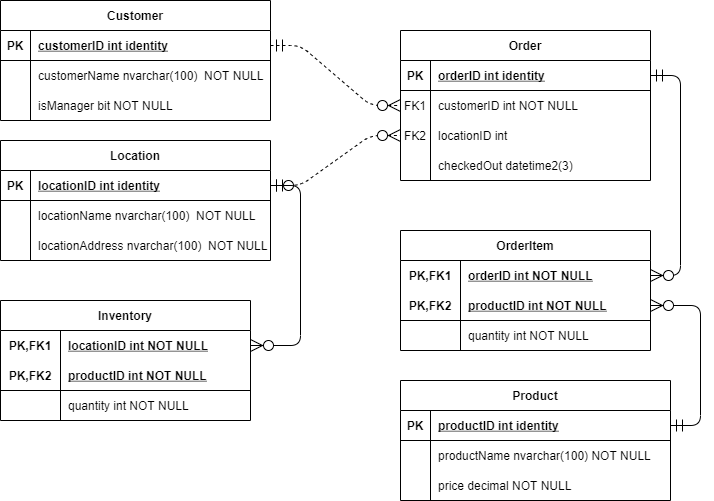

# Alan_Libby-P0

## Requirements
### Functionality
- [x] add a new customer
- [x] search customers by name
- [x] display details of an order
- [x] place orders to store locations for customers
- [x] view order history of customer
- [x] view order history of location
- [x] view location inventory
- [x] The customer should be able to purchase multiple products
- [x] Order histories should have the option to be sorted by date (latest to oldest and vice versa) or cost (least expensive to most expensive)
- [x] The manager should be able to replenish inventory

### Database Structure
- [x] Customer
- [x] Location
- [x] Order
- [x] Product

Additional tables: Inventory, OrderItem

### Additional Requirements
- [ ] Exception Handling
- [x] Input validation
- [ ] Logging using Serilog or Nlog
- [ ] At least 10 unit tests
- [x] Data should be persisted, (no data should be hard coded)
- [x] You should use SQLServer DB
- [x] DB structure should be 3NF
- [x] Should have an ER Diagram
- [ ] Code should have xml documentation

## ER Diagram
